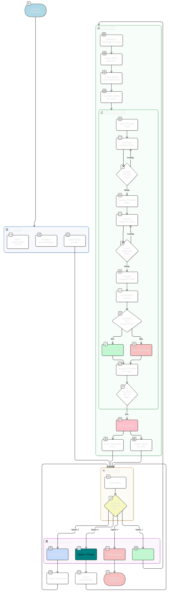

# Jogo da Memória


## Sobre

Jogo da Memória desenvolvido como trabalho para a disciplina de Algoritmos e Programação da UNIVALI (2025/1).

- **Desenvolvedores:**
  - Luiz Felipe de Souza ([PhilipsBr567](https://github.com/PhilipsBr567))
  - Matheus Pompeo Dias ([mapompeo](https://github.com/mapompeo))
  - Nathan Gustavo Padilha Reichert ([nathanreichert13](https://github.com/nathanreichert13))
- **Professor:** Michael Douglas Alves

O objetivo do projeto é exercitar lógica de programação, manipulação de matrizes e interação com o usuário em C++, simulando o clássico jogo da memória.

---

## Tecnologias Utilizadas

- **Linguagem:** C++
- **Compilador recomendado:** g++ (GCC)
- **Bibliotecas:**  
  - `<iostream>` (entrada/saída)
  - `<cstdlib>` (aleatoriedade)
  - `<ctime>` (semente aleatória)
  - `<windows.h>` (comandos de sistema e Sleep para Windows)

---

## Como Executar

1. **Compile o código** (no terminal, na pasta do projeto):
   ```sh
   g++ -o jogo-da-memoria main.cpp
   ```
2. **Execute o programa:**
   - No Windows:
     ```sh
     jogo-da-memoria.exe
     ```
   - No Linux/Mac (ajuste/remova comandos específicos do Windows, como `windows.h`, se necessário):
     ```sh
     ./jogo-da-memoria
     ```

---

## Diagrama do Jogo

Abaixo está o diagrama de funcionamento do jogo da memória, incluindo o fluxo principal de menus e jogadas:



---

## Licença

Este projeto é distribuído sob a seguinte licença:

[LICENÇA](./LICENSE)